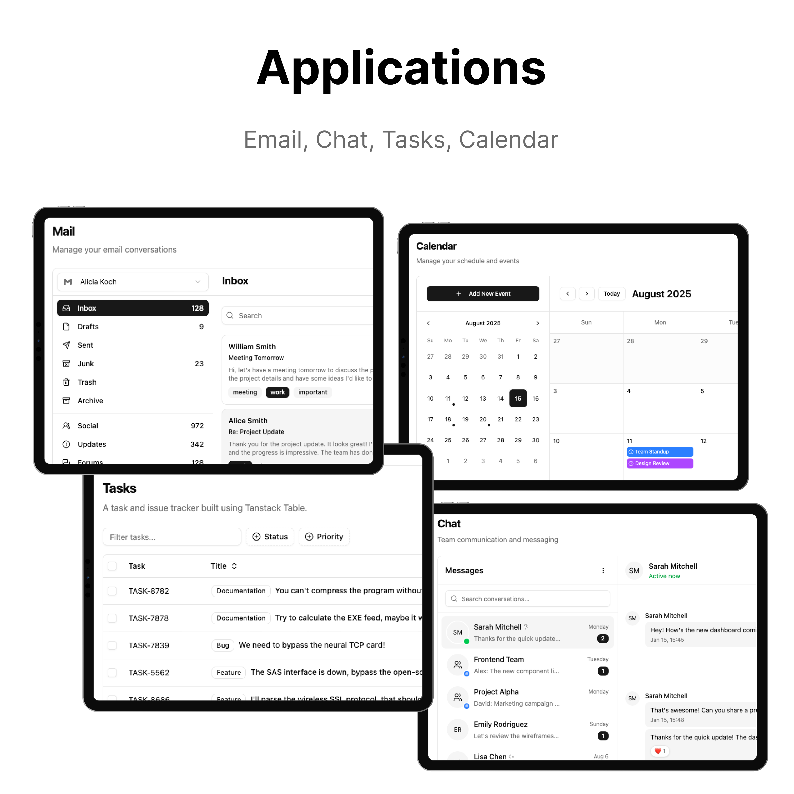

## ✨ AuraMetrics company

🎯 **Two Complete Pages:**

- **🖥️ AuraMetrics Dashboard** - Modern, feature-rich dashboard with 30+ pages
- **🌐 Landing Page** - Business-ready landing page

---

## 🚀 Key Features

### 📊 **Dashboard Features**

- **App Demos** - Mail, Tasks, Chat, Calendar, Users applications
- **10+ Pages** - Authentication, Settings, Errors, FAQ, Pricing
- **Data Tables** - Advanced tables with sorting, filtering, and pagination
- **Charts & Analytics** - Recharts integration with beautiful visualizations

### 🎨 **Design & Theming**

- **tweakcn Integration** - Professional theme management
- **Multiple Layouts** - Sidebar variants, collapsible navigation
- **Responsive Design** - Mobile-first approach with container queries
- **Dark/Light Mode** - Seamless theme switching

### ⚡ **Developer Experience**

- **Modern Tech Stack** - Next.js 16, React 19, TypeScript, Tailwind CSS v4
- **Type Safety** - Full TypeScript support throughout
- **Component Library** - Latest shadcn/ui v3 with Radix UI
- **Easy Customization** - Well-structured, modular codebase

## 📦 Tech Stack

### **Core Framework**

- **React 19** - Latest React with concurrent features
- **TypeScript** - Full type safety
- **Next.js 16** - Production-ready with App Router

### **UI & Styling**

- **shadcn/ui v3** - Latest component library
- **Radix UI** - Accessible primitives
- **Tailwind CSS v4** - Utility-first styling
- **tweakcn** - Advanced theme management
- **Lucide React** - Beautiful icons

### **State & Data**

- **Zustand** - Lightweight state management
- **React Hook Form** - Forms with validation
- **Zod** - Schema validation
- **TanStack Table** - Advanced data tables

### **Development**

- **ESLint** - Code linting
- **Prettier** - Code formatting
- **TypeScript** - Static type checking

---

## 📋 What's Included

### **🖥️ Dashboard Pages**

- **Dashboard** - Overview with analytics cards and charts
- **Dashboard v2** - Alternative dashboard with different metrics

### **📱 Application Demos**

- **📧 Mail** - Complete email interface (Inbox, Read, Compose)
- **✅ Tasks** - Task management with drag & drop
- **💬 Chat** - Real-time chat interface
- **📅 Calendar** - Event scheduling and management
- **👥 Users** - User management and profiles with advanced tables

### **🔐 Authentication**

- **Login** - 3 login page variants with different layouts
- **Sign Up** - 3 registration page variants with different designs
- **Forgot Password** - 3 password recovery page variants

### **⚙️ Settings & Profile**

- **User Settings** - Manage your personal information and preferences
- **Account Settings** - Profile management
- **Plans & Billing** - Subscription and payment pages
- **Appearance** - Theme and display preferences
- **Notifications** - Notification preferences
- **Connections** - Social media integrations

### **❌ Error Pages**

- **404** - Page not found
- **401** - Unauthorized access
- **403** - Forbidden
- **500** - Internal server error
- **Under Maintenance** - Maintenance mode page

### **🌐 Landing Page**

- **Hero Section** - Compelling headlines and CTAs
- **About Section** - Company/product introduction with interactive elements
- **Features Section** - Product/service highlights with icons
- **Stats Section** - Key metrics and achievements display
- **Logo Carousel** - Partner/client logos showcase
- **Team Section** - Team member profiles and information
- **Testimonials Section** - Customer reviews and social proof
- **Blog Section** - Latest blog posts and articles
- **Pricing Section** - Pricing tables and plans
- **FAQ Section** - Frequently asked questions with expandable answers
- **Contact Section** - Contact forms and information
- **CTA Section** - Call-to-action components
- **Navigation & Footer** - Complete navigation and footer components

### **📄 Additional Pages**

- **FAQ** - Frequently asked questions
- **Pricing** - Detailed pricing pages
